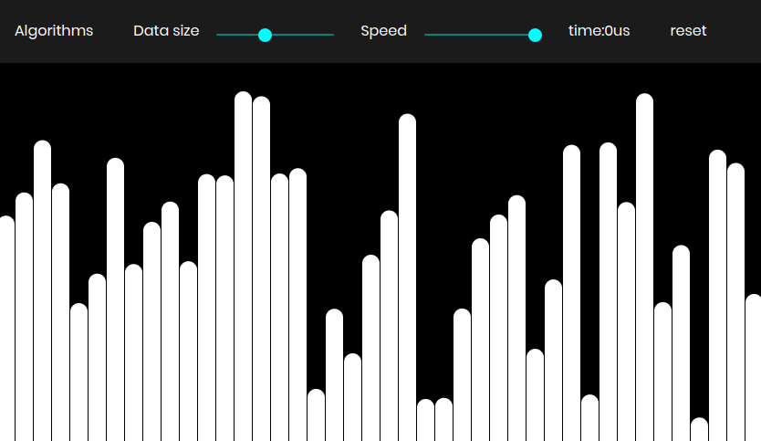

# Sorting Visualizer



> [Deployed on Vercel](https://sorting-analyser.vercel.app/)

---

## Live Demo Screenshots


---

## Live Demo

You can interact with the live demo of the Sorting Visualizer here:  
[https://sorting-analyser.vercel.app/](https://sorting-analyser.vercel.app/)

---

## Description

This project helps one to visualize a sorting algorithm. Each element of the array is displayed as a bar. The operations are colour coded such that:

1. Red-Orange - Swap
2. Cyan - Comparison
3. Gold - Element is in sorted position

It compares the time taken by the different algorithm for sorting the array.

## Features

- Visual representation of sorting algorithms in real-time
- Color-coded operations for easy understanding
- Time comparison between different sorting algorithms
- Interactive and educational tool for learning sorting concepts

---

## Technologies Used

- HTML
- CSS
- JavaScript (p5.js library)

---

## Setup and Installation

To run this project locally, follow these steps:

1. Clone the repository:

   ```bash
   git clone https://github.com/aritrobasu2003/Sorting_Analyser.git
   ```

2. Navigate to the project directory:

   ```bash
   cd sorting-visualizer
   ```

3. Open the `index.html` file in your preferred web browser. You can simply double-click the file or use a local development server such as:

   ```bash
   # Using Python 3.x
   python -m http.server 8000
   ```

   Then open `http://localhost:8000` in your browser.

---

## Usage

- Use the controls on the page to select the sorting algorithm you want to visualize.
- Adjust the array size and speed of the visualization as needed.
- Watch the sorting process with color-coded operations.
- Compare the time taken by different algorithms to understand their efficiency.

---

## Deployment

This project is deployed and accessible online:

- Vercel: [https://sorting-analyser.vercel.app/](https://sorting-analyser.vercel.app/)

---

## References

Inspiration taken from [coding train](https://www.youtube.com/watch?v=67k3I2GxTH8).

Useful links describing the algorithms used

- [Bubble Sort](https://en.wikipedia.org/wiki/Bubble_sort)
- [Selection Sort](https://en.wikipedia.org/wiki/Selection_sort)
- [Merge Sort](https://en.wikipedia.org/wiki/Merge_sort)
- [Quick Sort](https://en.wikipedia.org/wiki/Quicksort)

---

[Back To The Top](#sorting-visualizer)
